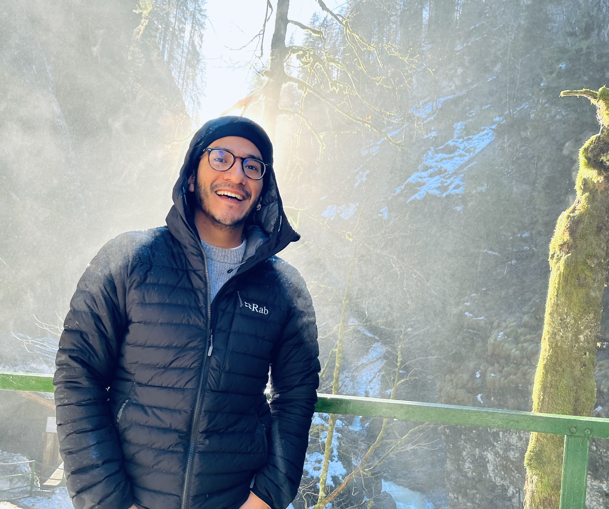

I am a fourth year PhD student at the Karlsruhe Institute of Technology in Germany under the supervision of [Claudio Llosa Isenrich](https://www.math.kit.edu/user/llosa/index.html). I expect to obtain my PhD in July 2024. 

In 2020 I completed my Master's at the University of Bonn under the supervision of [Ursula Hamenstädt](https://www.math.uni-bonn.de/people/ursula/). Before that, in 2018, I completed my Bachelor's at the National Autonomous University of Mexico (UNAM) under the supervision of [Carlos Prieto](https://paginas.matem.unam.mx/cprieto/).

Broadly my research is in geometric group theory. I am mainly interested in the asymptotic geometry of non-positive curved groups and other interesting classes of groups such as nilpotent groups. In particular, I have spent some time thinking about filling functions and finiteness properties of groups.

Here is my <a href="CV_JeronimoGarcia-Mejia.pdf">CV</a>.

I am currently on the postdoc job market.

